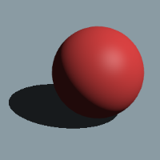

<!-- Improved compatibility of back to top link: See: https://github.com/othneildrew/Best-README-Template/pull/73 -->

<!--
*** Thanks for checking out the Best-README-Template. If you have a suggestion
*** that would make this better, please fork the repo and create a pull request
*** or simply open an issue with the tag "enhancement".
*** Don't forget to give the project a star!
*** Thanks again! Now go create something AMAZING! :D
-->

<!-- PROJECT SHIELDS -->
<!--
*** I'm using markdown "reference style" links for readability.
*** Reference links are enclosed in brackets [ ] instead of parentheses ( ).
*** See the bottom of this document for the declaration of the reference variables
*** for contributors-url, forks-url, etc. This is an optional, concise syntax you may use.
*** https://www.markdownguide.org/basic-syntax/#reference-style-links
-->
[![Contributors][contributors-shield]][contributors-url]
[![Forks][forks-shield]][forks-url]
[![Stargazers][stars-shield]][stars-url]
[![Issues][issues-shield]][issues-url]
[![MIT License][license-shield]][license-url]
[![LinkedIn][linkedin-shield]][linkedin-url]

<!-- PROJECT LOGO -->
 

  

<h3 align="center">Physics Sandbox</h3>

  

    A simple rigidbody physics simulator (UNFINISHED)
     
     
    <a href="https://josephhelfenbein.github.io/physics-sandbox">Visit</a>
    ·
    <a href="https://github.com/josephHelfenbein/physics-sandbox/issues/new?labels=bug&template=bug-report---.md">Report Bug</a>
    ·
    <a href="https://github.com/josephHelfenbein/physics-sandbox/issues/new?labels=enhancement&template=feature-request---.md">Request Feature</a>
  

<!-- TABLE OF CONTENTS -->

  
Table of Contents

  <ol>
    <li><a href="#about-the-project">About The Project</a></li>
    <li><a href="#roadmap">Roadmap</a></li>
    <li><a href="#license">License</a></li>
    <li><a href="#acknowledgments">Acknowledgments</a></li>
  </ol>

<!-- ABOUT THE PROJECT -->
## About The Project

A 3D physics engine made using JavaScript for the web. Featuring ray-traced shadows using WebGL and GLSL, particle dynamics, and rigid body dynamics.

### Built With

* [![JavaScript][JavaScript]][JavaScript-url]
* [![WebGL][WebGL]][WebGL-url]
* [![Bootstrap][Bootstrap.com]][Bootstrap-url]

<!-- ROADMAP -->
## Roadmap

- [x] Camera Movement
- [x] Object Instancing
- [x] Ray-traced Shadows
- [x] Specular Highlights
- [x] UI object spawning
- [x] Particle Dynamics
- [x] UI spawn templates
- [x] Rigid Body Dynamics

See the [open issues](https://github.com/josephHelfenbein/physics-sandbox/issues) for a full list of proposed features (and known issues).

<!-- LICENSE -->
## License

Distributed under the MIT License. See `LICENSE.txt` for more information.

<!-- ACKNOWLEDGMENTS -->
## Acknowledgments

* [Best README Template](https://github.com/othneildrew/Best-README-Template)

(<a href="#readme-top">back to top</a>)

<!-- MARKDOWN LINKS & IMAGES -->
<!-- https://www.markdownguide.org/basic-syntax/#reference-style-links -->
[contributors-shield]: https://img.shields.io/github/contributors/josephHelfenbein/physics-sandbox.svg?style=for-the-badge
[contributors-url]: https://github.com/josephHelfenbein/physics-sandbox/graphs/contributors
[forks-shield]: https://img.shields.io/github/forks/josephHelfenbein/physics-sandbox.svg?style=for-the-badge
[forks-url]: https://github.com/josephHelfenbein/physics-sandbox/network/members
[stars-shield]: https://img.shields.io/github/stars/josephHelfenbein/physics-sandbox.svg?style=for-the-badge
[stars-url]: https://github.com/josephHelfenbein/physics-sandbox/stargazers
[issues-shield]: https://img.shields.io/github/issues/josephHelfenbein/physics-sandbox.svg?style=for-the-badge
[issues-url]: https://github.com/josephHelfenbein/physics-sandbox/issues
[license-shield]: https://img.shields.io/github/license/josephHelfenbein/physics-sandbox.svg?style=for-the-badge
[license-url]: https://github.com/josephHelfenbein/physics-sandbox/blob/master/LICENSE.txt
[linkedin-shield]: https://img.shields.io/badge/-LinkedIn-black.svg?style=for-the-badge&logo=linkedin&colorB=555
[linkedin-url]: https://linkedin.com/in/joseph-j-helfenbein
[product-screenshot]: images/screenshot.png
[Next.js]: https://img.shields.io/badge/next.js-000000?style=for-the-badge&logo=nextdotjs&logoColor=white
[Next-url]: https://nextjs.org/
[React.js]: https://img.shields.io/badge/React-20232A?style=for-the-badge&logo=react&logoColor=61DAFB
[React-url]: https://reactjs.org/
[Vue.js]: https://img.shields.io/badge/Vue.js-35495E?style=for-the-badge&logo=vuedotjs&logoColor=4FC08D
[Vue-url]: https://vuejs.org/
[Angular.io]: https://img.shields.io/badge/Angular-DD0031?style=for-the-badge&logo=angular&logoColor=white
[Angular-url]: https://angular.io/
[Svelte.dev]: https://img.shields.io/badge/Svelte-4A4A55?style=for-the-badge&logo=svelte&logoColor=FF3E00
[Svelte-url]: https://svelte.dev/
[Laravel.com]: https://img.shields.io/badge/Laravel-FF2D20?style=for-the-badge&logo=laravel&logoColor=white
[Laravel-url]: https://laravel.com
[Bootstrap.com]: https://img.shields.io/badge/Bootstrap-563D7C?style=for-the-badge&logo=bootstrap&logoColor=white
[Bootstrap-url]: https://getbootstrap.com
[JQuery.com]: ?style=for-the-badge&logo=jquery&logoColor=whitehttps://img.shields.io/badge/jQuery-0769AD
[JQuery-url]: https://jquery.com 
[JavaScript]: https://img.shields.io/badge/javascript-yellow?logo=javascript&style=for-the-badge&logoColor=white
[JavaScript-url]: https://developer.oracle.com/languages/javascript.html
[WebGL]: https://img.shields.io/badge/webgl-red?logo=webgl&style=for-the-badge&logoColor=white
[WebGL-url]: https://www.khronos.org/webgl/
